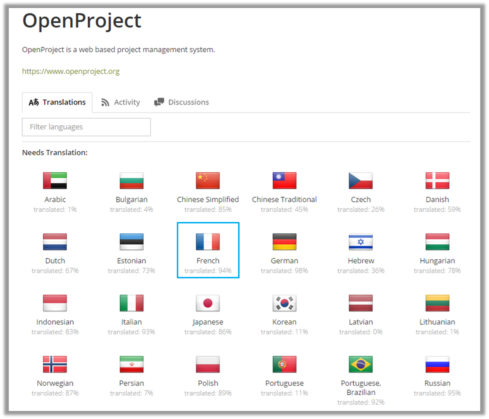
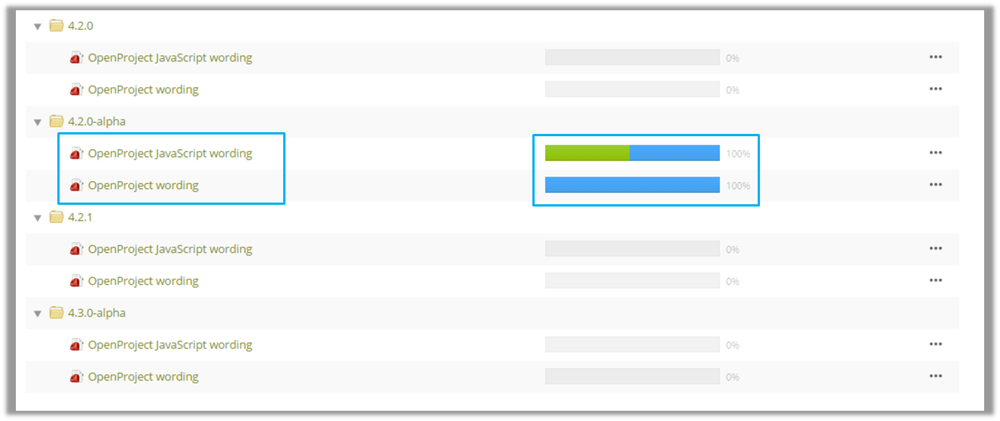

---
sidebar_navigation:
  title: Translate OpenProject
  priority: 985
description: How to translate OpenProject to your language
robots: index, follow
keywords: translation, translate, crowdin, localization
---

# Help translate OpenProject to your language

## OpenProject translations with CrowdIn

OpenProject is available in more than 30 languages.
Get an overview of the translation process and join us in translating OpenProject to your language.

In order to translate OpenProject, we use [CrowdIn](https://crowdin.com/projects/opf) as a platform where contributors can provide translations for a large number of languages.
We highly appreciate the help of anyone who wants to translate OpenProject to additional languages.
In order to provide translations not only for the OpenProject core but also for the plugins, we created several translation projects on CrowdIn:

* <a href="https://crowdin.com/project/openproject" target="_blank">Translate OpenProject</a>

To help us translate OpenProject, please follow the links above and follow the instructions below (see [“How to translate OpenProject via CrowdIn”](https://github.com/opf/openproject/new/release/6.1/doc/development#how-to-translate-openproject-via-crowdin)).
You can find this project list on https://crowdin.com/projects/opf.

## How the translation process works

Each of the projects listed above corresponds to a GitHub repository which contains the code for the OpenProject core and plugins.
When a new OpenProject version is developed it typically contains new English text (strings). 
CrowdIn facilitates the translation of those strings to different languages.
Here is how the translation process works in detail:

1. When a new OpenProject version is developed which contains new English words (strings) (on GitHub) the new strings are copied to the CrowdIn projects for the core and the plugins via the OpenProject CI.
2. Once the strings have been copied, they can be translated, voted on and approved via CrowdIn. Afterwards, these translations are copied to GitHub via the OpenProject CI and included in the release branch.
3. When the new OpenProject version is released users can use the translations in their own instances with the next OpenProject version.

## How to translate OpenProject via CrowdIn
You can easily help translate OpenProject by creating a (free) CrowdIn account and by joining the [OpenProject CrowdIn projects](https://crowdin.com/projects/opf).
Once you joined one or all of the projects, you can provide translations by following these steps:
1. Select the language for which you want to contribute (or vote for) a translation (below the language you can see the progress of the translation).

2. From the list of OpenProject versions, select the current version or a version which has not been completely translated yet. The blue bar shows the translation progress, the green bar the approving progress (can only be done by proof readers).
For some OpenProject projects (such as the OpenProject core) two files exist for one version: One file contains the basic translations (Ruby on Rails), the other file contains the strings associated with the Javascript part (AngularJS). Both files need to be translated to completely translate OpenProject. 
To provide a translation select a file from a version which has not been completely translated: 

3. Once a file is selected, all the strings associated with the version are displayed on the left side. To display the untranslated strings first, select the filter icon next to the search bar and select “All, Untranslated First”.
The red square next to an English string shows that a string has not been translated yet. To provide a translation, select a string on the left side, provide a translation in the target language in the text box in the right side (singular and plural) and press the save button.
As soon as a translation has been provided by another user (green square next to string), you can also vote on a translation provided by another user. The translation with the most votes is used unless a different translation has been approved by a proof reader.

Once a translation has been provided, a proof reader can approve the translation and mark it for use in OpenProject.

If you are interested in becoming a proof reader, please contact one of the project managers in the Openproject CrowdIn project or send us an email at support@openproject.org.

If your language is not listed in the list of CrowdIn languages, please contact our project managers or send us an email so we can add your language.

Find out more about our development concepts regarding translations [here](../concepts/translations).