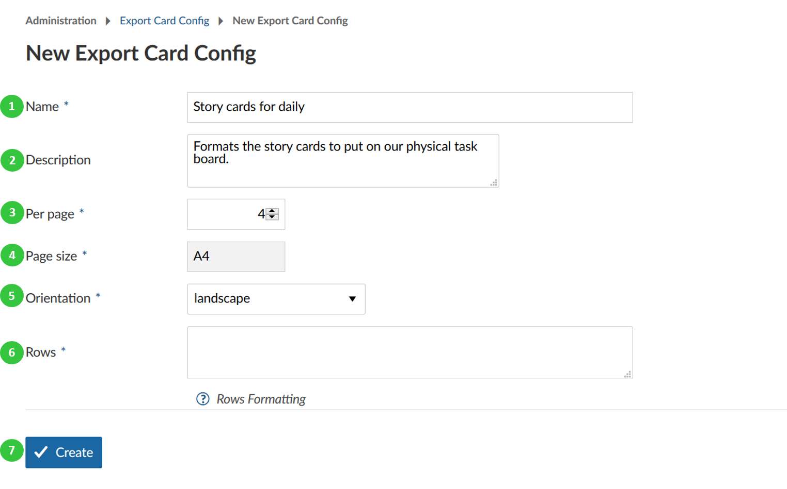

---
sidebar_navigation:
  title: Backlogs
  priority: 670
description: Configure backlogs in OpenProject.
robots: index, follow
keywords: configure backlogs, backlogs settings
---
# Backlogs configuration

Configure your backlogs settings in OpenProject.

Navigate to *Administration* -> *Backlogs* -> *Settings* to set up your backlogs.

You can configure the following in the backlogs settings:

1. Set the work package types which should be used as **story types**. Hold Ctrl (or Cmd on Mac) to choose several types. The story types will appear in the Backlogs view (product backlog, wish list, sprint) and can be created, prioritized directly in the Backlogs view, e.g. EPIC, FEATURE, BUG.
2. Set the **task type**. The task type will appear in the task board to manage in your daily stand ups.
   Please note: You can't use a work package type as story type *and* as task type.
3. Define to show **burn-down** or **burn-up** **chart**.
4. Set a template for **sprint wiki page**. If you create a wiki page with this name, e.g. sprintwiki, you will set up a new wiki page based on this template if you open it via the sprint drop-down menu in the backlogs view. This way, you can easily create templates for sprint review meetings or retrospectives.
5. Press the blue **apply** button to save your changes.

## Configure story cards to export

Some Scrum teams also want to export their story cards to put them on a physical board. You can export your story cards and set a certain format for this export.

Navigate to *Administration* -> *Backlogs* -> *Export Card Configs* in order to set a new story card configuration.

Press the green **+ Export Card Config** button to create a new story card export configuration.

1. Give a **name** for your story card export configuration.
2. You can add a **description**.
3. Define how many work packages (as defined as story types in the above settings, e.g. user stories) should be **printed per page**.
4. Set the **page size**.
5. Choose **landscape** or **portrait** for printing option.
6. **Set rows configuration**. See the help icon with the question mark for further information regarding the row formatting.
7. Press the blue **Create** button to save your changes.

