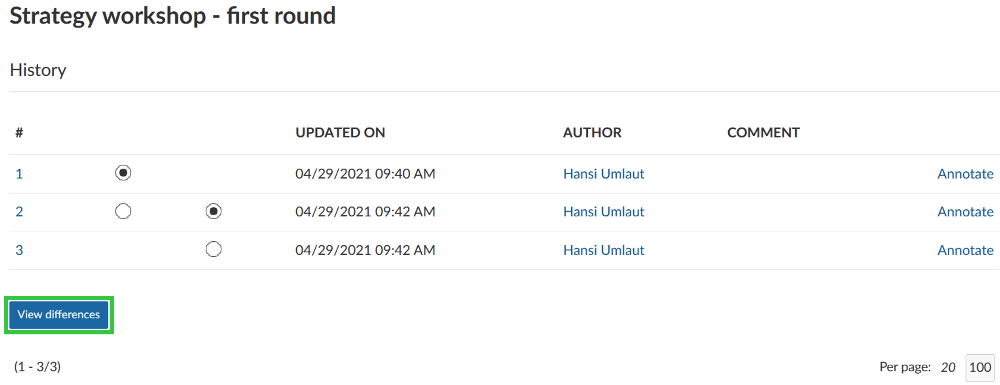
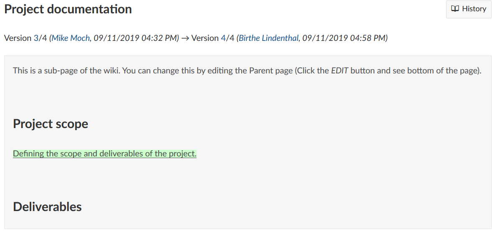
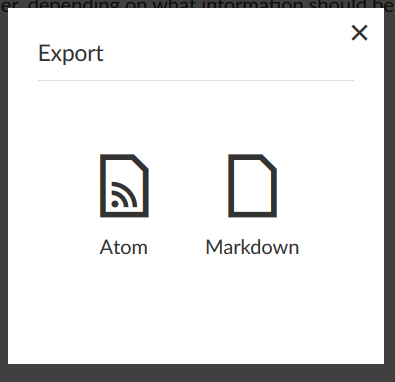

---
sidebar_navigation:
  title: More wiki functions
  priority: 797
title: More Wiki functions
description: Wiki settings in OpenProject.
robots: index, follow
keywords: wiki settings, delete wiki, lock wiki, export wiki
---

# More wiki functions

In the wiki you have more functions to edit or configure your wiki page, e.g. to export pages, rename pages, change parent page, view the table of contents and more.

| Topic                                             | Content                                                      |
| ------------------------------------------------- | ------------------------------------------------------------ |
| [Lock a wiki page](#lock-a-wiki-page)             | How to lock and unlock a wiki page and prevent others from editing it. |
| [Delete a wiki page](#delete-a-wiki-page)         | How to delete a wiki page.                                   |
| [Show wiki page history](#show-wiki-page-history) | How to display changes to a wiki page.                       |
| [Export a wiki page](#export-a-wiki-page)         | How to export a wiki page.                                   |

To open further configuration settings, navigate to a wiki page and click on the **More** button on top of the wiki page.

In the drop down menu, select the corresponding menu item.

## Lock a wiki page

To lock an existing wiki page and prevent others from editing the page, select the **More** button on top of the wiki page.

Select the item **Lock** in the drop down menu.

The page is now locked and cannot be edited by any other user. 

To unlock a wiki page and make it possible for users to edit it again, select the **Unlock** item under the **More** button on top of a wiki page.

It is now possible to edit the wiki page again.

## Delete a wiki page

If you want to delete a wiki page, select the page you want to delete and click the **More** button on top of the page.

Select the menu item **Delete** in the drop down menu.

Before the page will be deleted, you have to **re-confirm the deletion** once again by clicking on **OK** in the pop-up window.

Please be aware that a deleted wiki page cannot easily be restored within the system.

## Show wiki page history

In some cases, you might want to know the latest change to a wiki page.  You can get information on the type of change as well as on the author using the **History** option. To display it, choose **History** in the [**More** functions](#more-wiki-functions) drop-down menu on top of a wiki page.

First, you will get an overview on author and date of the latest updates. Potential comments can already give you an idea about the type of change. You can explicitly choose two versions to display a more detailed view of the changes between them using the blue **View differences** button at the bottom of the page.

**Note**: The more distance between two versions, the more difficult it becomes to compare them, since only the selected versions are compared (ignoring the changes that were made in the meantime). The most comprehensible information is thus provided by comparing two consecutive versions.

## Export a wiki page

To export a wiki page, open the **More** functions menu on a wiki page and select **Export**.

You can choose between **Atom** or **Markdown** export of your wiki page:

Alternatively, you can use your browser's print feature to **print a PDF** from a wiki page.